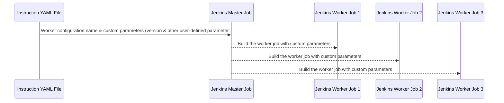

# Blaze - A Production Deployment Framework

A production deployment framework using various DevOps tools. It uses **Jenkins jobs** for the different tasks execution. Each task could perform any specific job like execution of any script for initiating the deployment in any other DevOps tools like uDeploy or Ansible. It gives you flexibility to execute the different tasks using same configuration multiple times based on the requirement. It has a dashboard page to display all the tasks execution in the single page. It follows the Master-Worker architecture that allows you to handle the execution of all tasks with ease.


# Prerequisites

- **Python 3.10** must be installed in the system
- Installation of **required python modules** must be done using requirements.txt file present in the current repository.
- Latest version of **Jenkins** installed in the system for the creation of master and worker job configuration (we will discuss about this in detail later on)
- Download blaze client: https://github.com/frostyaxe/Blaze-Client/releases/tag/v1.0-beta.1</br>
  (Use blaze-client for linux platform and blaze-client.exe for windows platform)

# Preview (Dashboard Page - Execution progress & Paused Pipeline)


# Setup Instructions

### Step 1: Blaze Configuration Update
- Open the config.py file present in this repository
- Update the Jenkins configuration
  <table>
    <tr>
      <th>Option</th>
      <th>Description</th>
    </tr>
    <tr>
      <td>SERVER_URL</td>
      <td>Jenkins server base url. For example: http://localhost:8000</td>
    </tr>
    <tr>
      <td>USERNAME</td>
      <td>Jenkins User ID. <strong>Note: Framework does not support anonymous access.</strong></td>
    </tr>
    <tr>
      <td>TOKEN</td>
      <td>Jenkins Authentication Token. Set the environment variable in the system named as "JENKINS_TOKEN" and keep the authentication there. <b>Do not hardcode authentication token in the file</b></td>
    </tr>
  <table>
- Update the blaze authentication details
  <table>
    <tr>
      <th>Option</th>
      <th>Description</th>
    </tr>
    <tr>
      <td>SECRET_KEY</td>
      <td>Random Secret Key String. <strong>Tip: Use MD5 string of any text that will be easy to remember. Please check the following link: <a href="https://www.md5hashgenerator.com"> Text to MD5 string</a></strong>. Store it in the environment variable named as "BLAZE_SECRET".</td>    
    </tr>
  </table>
    
- Update Email Configuration Details
  <table>
    <tr>
      <th>Option</th>
      <th>Description</th>
    </tr>
    <tr>
      <td>SENDER</td>
      <td>EMAIL ID of the sender.</td>
    </tr>
    <tr>
      <td>PROTOCOL</td>
      <td>Supports TLS & SSL</td>
    </tr>
    <tr>
      <td>SMTP</td>
      <td>Host & Port details. </br><strong>For Example ( GMAIL Details ):</strong></br>
      Gmail SMTP server address: <i><u>smtp.gmail.com</u></i>                    </br>
      Gmail SMTP port (TLS): <i><u>587</u></i>                                     </br>
      Gmail SMTP port (SSL): <i><u>465</u></i>                     
      </td> 
    </tr>
    <tr>
      <td>USERNAME</td>
      <td>Email ID of the User</td>
    </tr>
    <tr>
      <td>PASSWORD</td>
      <td>Password/Authentication token of the user. For gmail, Please generate the app password and use it instead of actual login password: https://myaccount.google.com/apppasswords.  Store it in the environment variable named as "EMAIL_SECRET".</td>
    </tr>
  </table>

### Step 2: Run the application.

- To run it on development server, execute the below command in the root folder of this repository.</br>
  `python blaze.py`

- If you want to run the application on any webserver then I suggest use **Gunicorn**.

## Step 3: Understand the Master & Worker Jobs in Jenkins

### What is master & worker configurations?
A master job in the jenkins reads the instruction from the instruction file(YAML) and based on the worker configuration name provided by the user, it initiates the execution of the Jenkins worker job with the custom parameters.



### What is the role of worker jobs?
Worker job can be any Jenkins configuration that could perform the actual task based on the inputs provided by user (if required). For example, You might have another tool for the continuous deployment and you have written a shell or python script to initiate the deployment from the Jenkins. Most of the deployments required version number. Hence you can parameterize this and let the master job handle the initiation of the execution with custom details.

### What is the role of master jobs?
Reads the details from the instruction YAML file (That will be talking about in detail further) and initiates the execution based on the details provided by the user. It reads the worker job configuration name and custom parameters provided by the user from the instruction file and triggers the build in the worker job with those custom parameters.

Note: Here you can reuse the same worker configuration for triggering the build with different custom parameters. 

### What is the role of instruction file?
Instruction file which is also known as "taskbook" will be having the details related to the worker job configuration name and required the custom parameters for the build. Taskbook consists of multiple tasks and each task might have the same or different configuration name and custom parameters. It handles the entire execution flow such as sequence of the tasks execution, pausing the pipeline after the desired task execution, skipping the task, rerunning the previous task and many more.

Simple taskbook file:
```
tasks:

    - name: "Deployment of Application Package"
      config: blazeconfig_app
      category: "predeploy"
      parameters:
          "version": "blaze_app-1.0.123"
    
    - name: "Pause Task"
      config: pause
      category: "predeploy"
      
    - name: "Deployment of DB Packages 122"
      config: blazeconfig_db
      category: "predeploy"
      parameters: 
          "version": "blaze_db-1.0.122"
          
    - name: "Deployment of DB Packages 123"
      config: blazeconfig_db
      category: "predeploy"
      parameters: 
          "version": "blaze_db-1.0.123"

```

<mark> **Note:** As you can see in the above example, we have used "blazeconfig_db" configuration twice for the deployments of two different versions.</mark>

## Step 4: Configuration of Jenkins Worker Job

A worker job will be a simple jenkins job that could take the version number as a build parameter and perform the deployment based on the configuration done in it.

There is no specific sample job configuration that we could suggest as it could be anything, you might want to initiate a deployment using REST API or any client over the continuous deployment tool. You might want to interact with autosys for the jobs execution. You might want to update JIRA IDs. You might have to perform backup activities. Hence based on your requirements the configuration will be changed only the dynamic inputs that you required could be parameterized here and the value for those dynamic parameters, we can provide in the instruction file (YAML File).

## Step 5: Configuration of Jenkins Master Job

Once the configuration for all the worker job is completed then you need to create a master job as per the steps provided below.
  1. blaze-client that you have downloaded while fulfiling the prerequisites, you need to set that client in the PATH variable.
  2. Once the blaze-client executable is set in the PATH variable then you can use below sample pipeline script for the configuration.
 ```
 pipeline {
    agent any

    stages {
        stage('Hello') {
            steps {
            //bat For windows, sh for linux. Verify the client extension as well. Do not use .exe on linux :)
                bat "blaze-client.exe --jenkins-server-url \"http://localhost:8080\" --tracker-url \"http://127.0.0.1:5000\" --jenkins-job-id ${BUILD_NUMBER} --jenkins-job-name \"${env.JOB_NAME}\" --taskbook \"taskbook.yml\" --app-name \"blaze\" --jenkins-username \"<username>\" --jenkins-secret \"<jenkins-secret>\" --blaze-secret \"<blaze-secret>\""
            }
        }
    }
}
```
### Blaze-Client Command Line Options:
- **--jenkins-server-url:** Base url of the Jenkins server. For example http://localhost:8080
- **--tracker-url:** Base url of the blaze tracker flask service. For example http://127.0.0.1:5000
- **--jenkins-job-id:** <i>No need to change anything here</i>
- **--jenkins-job-name:** <i>No need to change anything here</i>
- **--taskbook:** Path of the taskbook YAML file
- **--app-name:** Name of the registered application ( we will see that in detail later on ). Just ensure name must be in lowercase alphabets and does not have any special characters in it. Only underscore is allowed.
- **--jenkins-username:** Username of the Jenkins User.
- **--jenkins-sercret:** Password or authentication token of the Jenkins User
- **--blaze-secret:** Blaze secret key used in the flask service for the authentication. Hint: Check it in the config.py file. You might have set "BLAZE_SECRET" environment variable in your system.

### Configuring workers with the master job:

- Copy the URL of a worker job and prepare the Jenkins job name using it
  For example if the worker job url look like this -> http://localhost:8080/job/Production-Deployment/job/blaze-worker-app/
  then you need to split it as shown here ---> http://localhost:8080/job/ Production-Deployment/job/blaze-worker-app 
  then just remove the job/ from here Production-Deployment/job/blaze-worker-app
  and the job name will be "<strong>Production-Deployment/blaze-worker-app</strong>"
- Now create a parameter in the worker job with the name having following prefix "<b>blazeconfig_</b>"
- Create another parameter named as "<strong>blaze.execution.category</strong>" with the value as "<i>predeploy</i>". It depicts the phase for which the master job is created. You might be having predeployment, deployment and post deployment steps to be performed in the entire production deployment. Hence this allows you to define the category of the master job.

## Step 5: Creation of Taskbook

Now it's time to prepare the taskbook that will drive the entire production deployment. Simple taskbook starts with <i>tasks</i> key and underneath that you will be having various tasks that you need to perform.

```
---
tasks
    - name: "Deployment of Application Package"
      config: blazeconfig_app
      category: "predeploy"
      parameters:
          "version": "blaze_app-1.0.123"

```

### Blaze Task Parameters

```
"*" denotes mandatory parameter
"NA" means Not Applicable
```

<table>
  <tr>
    <th>Name</th>
    <th>Type</th>
    <th>Default</th>
    <th>Description</th>
    <th>Example</th>
  </tr>
  <tr>
    <td>name*</td>
    <td>string</td>
    <td>NA</td>
    <td>Any descriptive name containing alphanumeric values separated by space. Do not use any specical character except underscore.</td>
    <td>Deployment of app package_123</td>
  </tr>
  <tr>
    <td>category*</td>
    <td>string</td>
    <td>NA</td>
    <td>It depicts the deployment phase. The value that you have mentioned in the Jenkins master job parameter "<strong>blaze.execution.category</strong>", you need to provide here</td>
    <td>pre_deploy, release_deploy, post_deploy</td>
  </tr>
  <tr>
    <td>config*</td>
    <td>string</td>
    <td>NA</td>
    <td>
      Either it could be user defined config that you can get it from the Jenkins Master Job parameter having the prefix as "<b>blazeconfig_</b>" or it could be predefined config such as "<b>pause</b>"
      <ul>
        <li>All the user defined parameters will be having the prefix as "<b>blazeconfig_</b>" in the Jenkins master job.</li>
        <li>Predefined parameter: "<b>pause</b> - To halt the pipeline for manual verification."</li>
      </ul>
    </td>
    <td>Deployment of app package_123</td>
  </tr>
  <tr>
    <td>skip</td>
    <td>bool</td>
    <td>False</td>
    <td>If True then it skips the execution of that particular task. Widely used when an execution of a task gets failed and you do not need to re-run it instead of that you prefer to skip it.</td>
    <td>True, False</td>
  </tr>
  <tr>
    <td>monitor</td>
    <td>bool</td>
    <td>True</td>
    <td>By default, it handles all the execution of tasks sequentially in the foreground. If you specify the value as False then, execution will happen in the background.</br> :warning: <mark>If it is False then, it will fire the task execution and forgets about the execution status.</br> :warning: It will not monitor the execution at all <b>even if it is failed</b></mark> </td>
    <td>True, False</td>
  </tr>
  <tr>
    <td>allowFailure</td>
    <td>bool</td>
    <td>False</td>
    <td>If True then even the execution fails, it will proceed with the execution of next task. </br>
    :warning: If the execution of a task having this flag gets failed and you re-run the master job or resume the pipeline after the pause then, it will re-run that failed task.</br>
    <b>If you do not want to re-run it then, use <i>skip</i> flag.</b>
    </td>
    <td>True, False/td>
  </tr>
</table>
